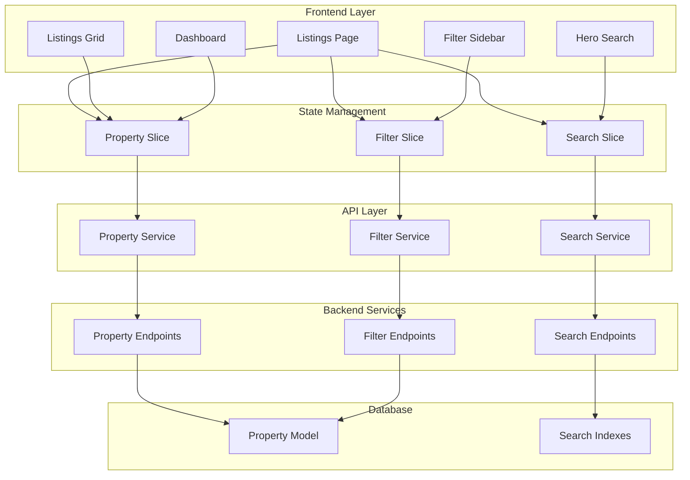
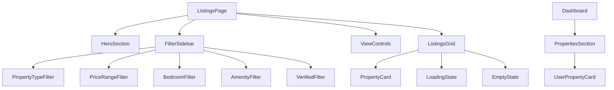

# Design Document

## Overview

This design enhances the existing property rental application by improving the property listing display, implementing comprehensive search functionality, and adding a robust filtering system. The solution builds upon the current MERN stack architecture with Redux state management, extending the existing property and search services to provide a more sophisticated property discovery experience.

The design focuses on three core areas:
1. **Enhanced Property Listing** - Improved display with better loading states, view modes, and data handling
2. **Advanced Search System** - Enhanced search with better query processing and result relevance
3. **Comprehensive Filter Engine** - Multi-criteria filtering with real-time updates and state persistence

## Architecture

### High-Level Architecture



### Component Hierarchy



## Components and Interfaces

### Frontend Components

#### Enhanced ListingsPage Component
- **Purpose**: Main container for property listings with integrated search and filtering
- **State Management**: Manages properties, loading states, view modes, and filter states
- **Key Features**:
  - Unified state management for search results and filtered properties
  - Debounced search and filter operations
  - URL state synchronization for bookmarkable searches
  - Responsive layout with sidebar toggle

#### FilterSidebar Component
- **Purpose**: Comprehensive filtering interface with multiple criteria
- **Filter Types**:
  - Property Type (radio selection)
  - Price Range (min/max inputs with validation)
  - Bedrooms (multi-select chips)
  - Amenities (checkbox list)
  - Verified Properties (toggle)
  - Location/City (autocomplete)
- **Features**:
  - Collapsible sections with state persistence
  - Real-time filter application
  - Filter count indicators
  - Clear all functionality

#### Enhanced ListingsGrid Component
- **Purpose**: Responsive property display with multiple view modes
- **View Modes**: Grid, List, Map (placeholder)
- **Features**:
  - Lazy loading for performance
  - Skeleton loading states
  - Empty state handling
  - Infinite scroll or pagination
  - Sort options integration

#### PropertyCard Component Enhancements
- **Purpose**: Consistent property display across all views
- **Variants**: Grid card, List card, Dashboard card
- **Features**:
  - Optimized image loading with placeholders
  - Favorite/wishlist integration
  - Quick action buttons
  - Responsive design
  - Accessibility compliance

### Backend API Enhancements

#### Property Endpoints
```javascript
// Enhanced property endpoints
GET /api/properties - List all properties with pagination and basic filters
POST /api/properties/search - Advanced search with multiple criteria
POST /api/properties/filter - Apply filters to property set
GET /api/properties/user/:userId - Get user's properties
GET /api/properties/:id - Get single property details
```

#### Search and Filter Query Structure
```javascript
// Search payload structure
{
  query: string,           // Text search
  location: string,        // City/area
  type: string,           // Property type
  filters: {
    priceRange: { min: number, max: number },
    bedrooms: number[],
    amenities: string[],
    propertyTypes: string[],
    verifiedOnly: boolean,
    furnishing: string[],
    availableFrom: date
  },
  sort: string,           // Sort criteria
  page: number,           // Pagination
  limit: number           // Results per page
}
```

## Data Models

### Enhanced Property Data Structure
The existing Property model supports the required functionality with these key fields:
- **Search Fields**: title, description, city, address (text indexed)
- **Filter Fields**: category, propertyType, monthlyRent, bedrooms, amenities, furnishing
- **Location**: GeoJSON for location-based searches
- **Status**: active/inactive for filtering available properties

### Filter State Model
```javascript
// Frontend filter state structure
{
  propertyType: string,
  priceRange: { min: number, max: number },
  bedrooms: number[],
  amenities: string[],
  furnishing: string[],
  verifiedOnly: boolean,
  location: string,
  availableFrom: date,
  sortBy: string,
  viewMode: string
}
```

### Search Result Model
```javascript
// Search result structure
{
  properties: Property[],
  totalCount: number,
  currentPage: number,
  totalPages: number,
  filters: AppliedFilters,
  searchQuery: string,
  executionTime: number
}
```

## Correctness Properties

*A property is a characteristic or behavior that should hold true across all valid executions of a system-essentially, a formal statement about what the system should do. Properties serve as the bridge between human-readable specifications and machine-verifiable correctness guarantees.*

Based on the prework analysis, I'll consolidate related properties to eliminate redundancy:

**Property Reflection:**
- Properties 1.2, 4.4 can be combined into one loading state property
- Properties 1.5, 4.2 can be combined into one property information display property  
- Properties 2.1, 3.1 can be combined into one search/filter functionality property
- Properties 5.2, 5.3 can be combined into one graceful data handling property
- Properties 6.2, 6.3, 6.4 can be combined into one performance optimization property

### Property 1: Property Display Consistency
*For any* property listing view (grid, list, or dashboard), all displayed properties should contain the essential information fields (title, price, location, image) and render in the correct format
**Validates: Requirements 1.1, 1.5, 4.2**

### Property 2: Loading State Management
*For any* property data fetching operation, the system should display appropriate loading indicators while data is being retrieved and hide them when loading completes
**Validates: Requirements 1.2, 4.4**

### Property 3: Search and Filter Functionality
*For any* search query or filter criteria applied to a property dataset, the returned results should contain only properties that match the specified criteria
**Validates: Requirements 2.1, 3.1**

### Property 4: Multiple Filter Combination
*For any* combination of multiple filter criteria, the system should return only properties that satisfy ALL applied filters using logical AND operations
**Validates: Requirements 3.2**

### Property 5: State Persistence Across View Changes
*For any* view mode change (grid to list or vice versa), the current search query and applied filters should remain unchanged
**Validates: Requirements 1.4, 3.4**

### Property 6: User-Specific Property Filtering
*For any* property owner accessing their dashboard, only properties where the owner ID matches the current user ID should be displayed
**Validates: Requirements 4.1**

### Property 7: Search Result Relevance Ordering
*For any* search query that returns multiple results, the properties should be ordered by relevance score or defined ranking criteria
**Validates: Requirements 2.2**

### Property 8: Filter and Search Reset Functionality
*For any* filter clearing operation, the system should reset to display either all available properties (if no search) or current search results (if search is active)
**Validates: Requirements 3.3**

### Property 9: Graceful Data Handling
*For any* property with missing or incomplete information, the system should display appropriate fallbacks (placeholder images, default values) without breaking the layout
**Validates: Requirements 5.2, 5.3**

### Property 10: Data Validation and Normalization
*For any* property data received from the server, the system should validate the structure and normalize inconsistent formats before display
**Validates: Requirements 5.1**

### Property 11: Cross-View Data Consistency
*For any* property data update, the changes should be reflected consistently across all views (listings, dashboard, detail) that display that property
**Validates: Requirements 5.4**

### Property 12: Error Handling and Recovery
*For any* network error or invalid input, the system should provide user-friendly error messages and appropriate recovery options
**Validates: Requirements 2.5, 5.5**

### Property 13: Performance Optimization
*For any* property listing operation, the system should implement performance optimizations including pagination, image lazy loading, and input debouncing
**Validates: Requirements 6.1, 6.2, 6.3**

### Property 14: Navigation State Preservation
*For any* navigation between property-related pages, the system should maintain appropriate view state and scroll position where relevant
**Validates: Requirements 6.5**

### Property 15: Property Type Consistency
*For any* property type selection across different search interfaces (homepage, listings page), the system should use the same property type values and mapping logic
**Validates: Requirements 7.1, 7.2, 7.3**

### Property 16: Location Handling Consistency
*For any* location input or detection across different search components, the system should use the same geolocation service, validation, and formatting logic
**Validates: Requirements 8.1, 8.2, 8.3, 8.5**

### Property 17: Search Parameter Standardization
*For any* search operation initiated from different interfaces, the system should use a consistent search payload structure and validation rules
**Validates: Requirements 9.1, 9.2, 9.5**

### Property 18: Filter State Synchronization
*For any* filter state change or navigation between views, the system should maintain consistent filter values and properly synchronize state across components
**Validates: Requirements 10.1, 10.2, 10.3, 10.4**

## Error Handling

### Client-Side Error Handling
- **Network Failures**: Retry mechanisms with exponential backoff
- **Invalid Data**: Graceful degradation with placeholder content
- **Search Errors**: Fallback to showing all properties with error notification
- **Filter Errors**: Reset to default state with user notification

### Server-Side Error Handling
- **Database Connection Issues**: Return cached results when possible
- **Invalid Query Parameters**: Sanitize and provide default values
- **Search Index Failures**: Fallback to basic database queries
- **Rate Limiting**: Implement request throttling and queue management

### User Experience Error Handling
- **Empty Results**: Provide helpful suggestions and alternative searches
- **Slow Loading**: Progressive loading with skeleton screens
- **Image Loading Failures**: Immediate placeholder display
- **Filter Conflicts**: Clear conflicting filters with user notification

## Testing Strategy

### Dual Testing Approach
The testing strategy combines unit testing for specific scenarios and property-based testing for universal behaviors:

**Unit Testing Focus:**
- Specific user interaction scenarios (clicking filters, searching)
- Edge cases (empty results, network failures)
- Component integration points
- Error boundary behavior

**Property-Based Testing Focus:**
- Universal properties that should hold across all inputs
- Data consistency across different views
- Filter and search result correctness
- Performance characteristics under various loads

### Property-Based Testing Implementation
- **Library**: Use `fast-check` for JavaScript property-based testing
- **Test Configuration**: Minimum 100 iterations per property test
- **Property Test Tagging**: Each test tagged with format: `**Feature: property-listing-search-filter, Property {number}: {property_text}**`
- **Generator Strategy**: Create smart generators for properties, search queries, and filter combinations that represent realistic user scenarios

### Unit Testing Implementation
- **Framework**: Vitest for unit testing (already configured in the project)
- **Component Testing**: React Testing Library for component behavior
- **API Testing**: Mock API responses for consistent testing
- **Integration Testing**: Test complete user workflows

### Test Coverage Requirements
- All correctness properties must be implemented as property-based tests
- Critical user paths must have unit test coverage
- Error scenarios must be explicitly tested
- Performance characteristics must be validated

## Search and Filter Consistency Strategy

### Property Type Standardization
To ensure consistency across all search interfaces, we need to standardize property types:

**Standard Property Types:**
- `apartment` - Modern apartments and flats
- `house` - Independent houses and villas  
- `room` - Single rooms in shared accommodations
- `studio` - Studio apartments and 1RK units
- `pg` - Paying guest accommodations
- `shared` - Shared rooms and co-living spaces

**Implementation:**
- Create a centralized property type mapping service
- Update homepage search to use standard property types
- Ensure filter sidebar uses the same property type values
- Add property type normalization in data processing

### Location Handling Standardization
Standardize location handling across all search components:

**Standard Location Object:**
```javascript
{
  city: string,
  state: string,
  country: string,
  formatted: string, // "City, State"
  coordinates: { lat: number, lng: number }
}
```

**Implementation:**
- Use consistent geolocation service (BigDataCloud API)
- Standardize location autocomplete data source
- Implement location validation and formatting utilities
- Ensure consistent location display format

### Search Parameter Standardization
Standardize search payload structure across all components:

**Standard Search Payload:**
```javascript
{
  location: {
    city: string,
    state: string,
    formatted: string
  },
  propertyType: string, // Using standard property types
  keywords: string,
  filters: {
    priceRange: { min: number, max: number },
    bedrooms: string[],
    amenities: string[],
    furnishing: string[],
    verifiedOnly: boolean
  }
}
```

### Filter State Synchronization
Implement consistent filter state management:

**Centralized Filter State:**
- Single source of truth for all filter values
- Consistent validation across all components
- URL synchronization for bookmarkable states
- Proper state restoration on navigation

## Implementation Notes

### State Management Strategy
- Extend existing Redux slices for property and search
- Add new filter slice for filter state management
- Implement middleware for URL synchronization
- Use RTK Query for efficient data fetching and caching
- Add consistency validation middleware

### Consistency Utilities
- Create property type mapping utilities
- Implement location standardization services
- Add search parameter validation and normalization
- Create filter state synchronization helpers

### Performance Considerations
- Implement virtual scrolling for large property lists
- Use React.memo for property card components
- Implement image lazy loading with intersection observer
- Add service worker for offline property browsing

### Accessibility Requirements
- ARIA labels for all filter controls
- Keyboard navigation support
- Screen reader compatibility
- High contrast mode support
- Focus management for dynamic content updates

### Mobile Responsiveness
- Collapsible filter sidebar for mobile
- Touch-friendly filter controls
- Optimized image sizes for different screen densities
- Swipe gestures for property card interactions